# Jetbrain Active Code

     


## Software
|                   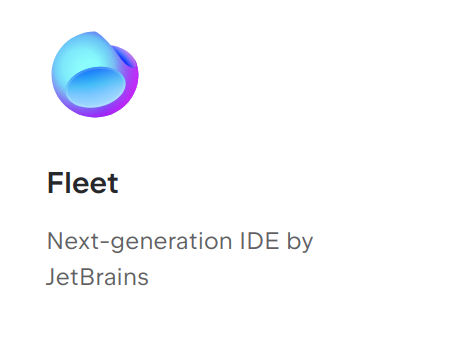                    |                   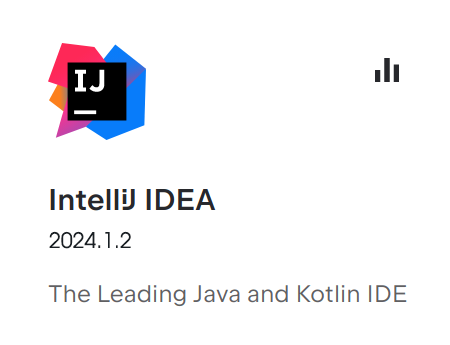                    |                 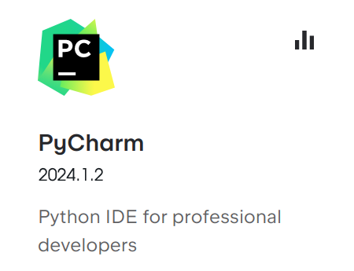                  |                  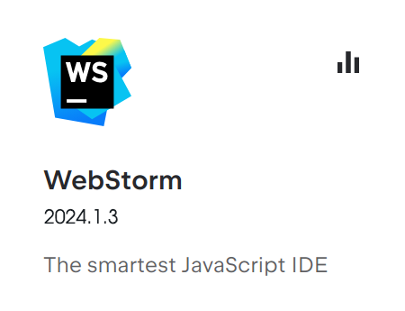                  |
| :-------------------------------------------------------: | :------------------------------------------------------: | :-----------------------------------------------------: | :------------------------------------------------------: |
|  [Download](https://www.jetbrains.com/pycharm/download/)  |   [Download](https://www.jetbrains.com/idea/download/)   | [Download](https://www.jetbrains.com/pycharm/download/) | [Download](https://www.jetbrains.com/webstorm/download/) |
|                  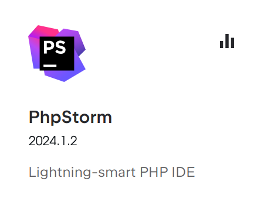                  |                   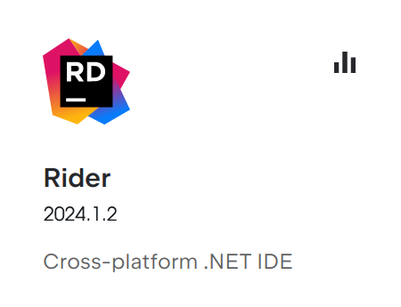                   |                  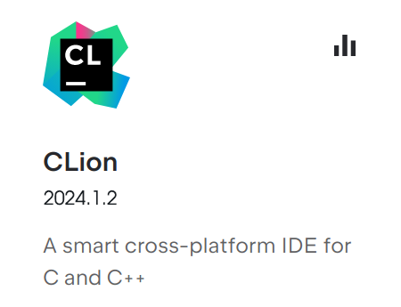                   |                 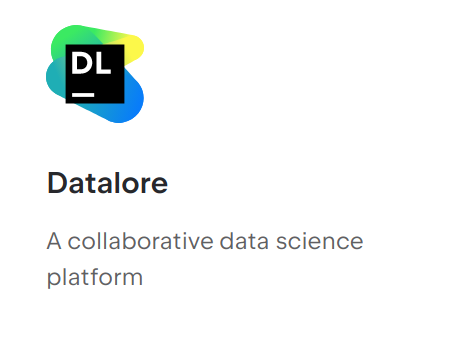                  |
| [Download](https://www.jetbrains.com/phpstorm/download/)  |  [Download](https://www.jetbrains.com/rider/download/)   |  [Download](https://www.jetbrains.com/clion/download/)  |  [Get it for free](https://www.jetbrains.com/datalore/)  |
|                 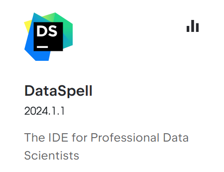                  |                 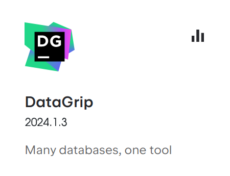                  |                 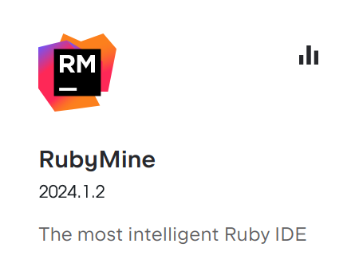                 |                  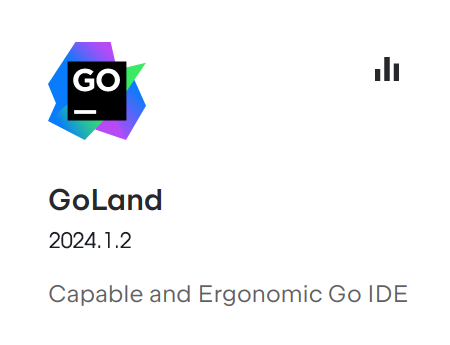                   |
| [Download](https://www.jetbrains.com/dataspell/download/) | [Download](https://www.jetbrains.com/datagrip/download/) |  [Download](https://www.jetbrains.com/ruby/download/)   |    [Download](https://www.jetbrains.com/go/download/)    |
|                                                           |                                                          |                                                         |                                                          |

## jetagent

```shell
jetagent/
├── config-jetbrains
│   ├── dns.conf
│   ├── power.conf
│   └── url.conf
├── ja-netfilter.jar
├── plugins-jetbrains
│   ├── dns.jar
│   ├── hideme.jar
│   ├── power.jar
│   └── url.jar
├── scripts
│   ├── install-all-users.vbs
│   ├── install-current-user.vbs
│   ├── install.sh
│   ├── uninstall-all-users.vbs
│   ├── uninstall-current-user.vbs
│   └── uninstall.sh
└── vmoptions
    ├── appcode.vmoptions
    ├── clion.vmoptions
    ├── datagrip.vmoptions
    ├── dataspell.vmoptions
    ├── devecostudio.vmoptions
    ├── gateway.vmoptions
    ├── goland.vmoptions
    ├── idea.vmoptions
    ├── jetbrains_client.vmoptions
    ├── jetbrainsclient.vmoptions
    ├── phpstorm.vmoptions
    ├── pycharm.vmoptions
    ├── rider.vmoptions
    ├── rubymine.vmoptions
    ├── studio.vmoptions
    ├── webide.vmoptions
    └── webstorm.vmoptions
```

```shell
sh ./scripts/install.sh
```
Done. You would better log off first!

## Windows
Click run `IDEA.vbs`

## Linux
- idea.key -> jetbrain activate code
- idea.sh -> shell

```shell
sh idea.sh
```

## Mac
- idea.key -> jetbrain activate code
- idea.sh -> shell

```shell
sh idea.sh
```
## Usage

- [docs](./wiki/): install tutorial

## Disclaimers
- [Disclaimers](DISCLAIMER.md)
